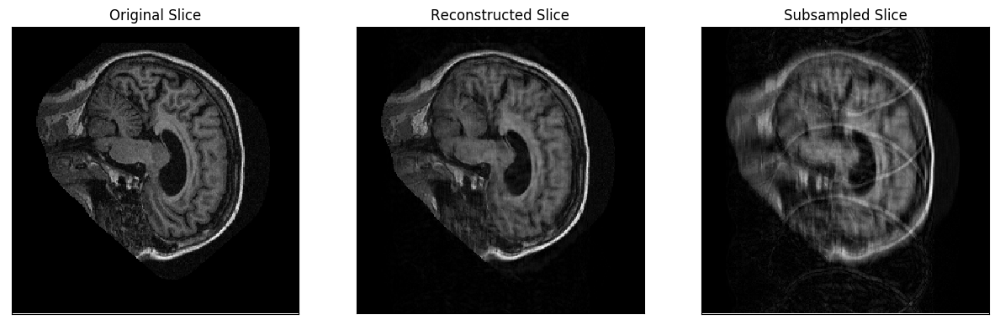
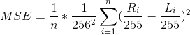

# SubMRIne
An open source implementation of the deep learning platform for undersampled MRI reconstruction described by Hyun et. al. (https://arxiv.org/pdf/1709.02576.pdf). In cojunction with this reimplementation, there is a writeup including extension experiments beyond those described in Hyun et. al. ([http://corey-zumar.github.io/submrine/](http://corey-zumar.github.io/submrine)).

## Introduction

Nuclear magnetic resonance imaging (MRI) is a technique that uses strong magnetic fields and radio waves to generate images of the body based on signals from protons. It is used to non-invasively provide physicians with visual information of a patient's anatomy. MRI is an expensive technique, it can be difficult to apply to children due to its sensitivity to movement, and its long scan duration can prove troublesome for some patients with claustrophobia. If a system could take undersampled MRI data and produce medically acceptable images, then the MRI scan time could be reduced, decreasing the procedure's cost and allowing more access for claustrophobic patients.

MRI techniques collect raw data, known as *k-space* data, and produce images through complex data processing and inverse Fourier transforms. The raw *k-space* data is known to be low-quality with many missing entries, motivating research surrounding image reconstruction. Current MRI techniques must use intrascan data to reconstruct medically acceptable images, with state of the art techniques beginning to leverage inter-scan data to improve MRI acquisition.

Producing medically acceptable images from highly undersampled (25-30\% of the current standard) MR data was the main challenge faced by Hyun et. al. In their paper, they demonstrated that the use of subsampling in conjunction with deep learning methods can produce MR images comparable to those of standard reconstruction techniques, reducing data collection and processing overhead. Here, we present a reimplementation of Hyun et. al.'s described method as a user-friendly python package. In addition to providing tools to replicate the results of Hyun et. al. using full-resolution training and test data, we include a procedure for reconstructing undersampled MR images for which full-resolution versions may not exist (**COMING SOON**).



## Installation
This implementation is packaged to be PyPI compatible. The package is called `submrine`. It can be installed by invoking the following from the repository's root directory:

```sh
$ pip install -e submrine
```

The installation process creates two console entry points: `submrine-train` and `submrine-eval` that can be used to **train** reconstruction networks and **evaluate** the reconstruction process on test images and datasets, respectively.

## Usage

The following **training** and **evaluation** examples make use of the free [OASIS](http://www.oasis-brains.org/) dataset of saggital plane brain images.

### Training

1. Download and extract a [disc](http://www.oasis-brains.org/app/template/Tools.vm) of brain images from the OASIS data set.

2. Move the **RAW** images from the disc to a separate training disc

   ```sh
   $ mv /path/to/disc/root/*/RAW /path/to/training/disc
   ```

3. Train the Keras MR image reconstruction network on a subset of the training disc of size `SIZE`:

   ```sh
   $ submrine-train -d /path/to/training/disc -s <SIZE> -c /path/to/checkpoints/directory -g <num_gpus> -b <batch_size> -s 4 -f .04
   ```
   
4. After each training iteration of SGD, network checkpoints will be saved to the checkpoints directory specified by the `-c/--checkpoints_dir` flag. 
   
### Test Evaluation

These evaluation procedures allow users to benchmark the effectiveness of the implementation quantitatively or qualitatively by operating on a dataset of full-resolution MR images. These MR images are deliberately subsampled, reconstructed, and compared against their original contents to provide insight into the method's effectiveness. As in the **training** section, these examples make use of the [OASIS](http://www.oasis-brains.org/) dataset.

#### Obtaining diff plots for a single MR image

For testing purposes, this evaluation procedure will produce diff plots for each slice in a specified full-resolution MR image.
The diff plots for every slice consists of the following grayscale images:

   * The original slice
   * A subsampled copy of the slice
   * A reconstruction of the subsampled slice 

The steps for obtaining these plots are as follows:

   1. Select a saggital plane brain test image from the [OASIS](http://www.oasis-brains.org/) dataset.

   2. Select one of the reconstruction neural networks that you have trained on the [OASIS](http://www.oasis-brains.org/) dataset. Alternatively, select [one of the pretrained neural networks for the oasis dataset](pretrained_nets/oasis).

   3. Obtain loss for every slice in the OASIS test image by invoking the following command:

      ```sh
      $ submrine-eval -n /path/to/reconstruction/network -i /path/to/test/image -r /path/to/results/dir -s 4 -f .04
      ```

      The diff plots for every slice will be saved in the directory specified by the `-r/--results_dir` flag. Note that the values associated with the `-s/--substep` and `-f/--lf_percent` flags are consistent with the values used in the **training** section. The same values should be used for training and evaluation.
   
#### Computing loss over a test set

For testing purposes, this evaluation procedure will produce loss metrics over a test dataset of full-resolution MR images.
These loss metrics consist of the following information:

   1. The MSE (or SSIM) between original MR image slices and their reconstructed versions after subsampling.
   2. The standard deviation associated with **(1)**
   3. The MSE (or SSIM) between original MR image slices and their subsampled (**aliased**) versions
   4. The standard deviation associated with **(3)**
   
   * MSE (mean normalized per-pixel squared error) is defined as:

      

      such that `L_i` is a slice of a full-resolution MR image and `R_i` is a subsampled and reconstructed version of the slice. For a detailed explanation of this definition, please refer to the **Loss Calculation** subsection on **Page 4** of the writeup ([http://corey-zumar.github.io/submrine/](http://corey-zumar.github.io/submrine/)). 

   * Information regarding SSIM is available here: [https://en.wikipedia.org/wiki/Structural_similarity] (https://en.wikipedia.org/wiki/Structural_similarity)

The steps for obtaining these results on a sample test set are as follows:

1. Download and extract a [different disc](http://www.oasis-brains.org/app/template/Tools.vm) of brain images from the OASIS data set.

2. Move the **RAW** images from the disc to a separate test disc

   ```sh
   $ mv /path/to/disc/root/*/RAW /path/to/test/disc
   ```
   
3. Compute loss metrics over a subset of the test disc of size `SIZE` as follows:

   ```sh
   $ submrine-eval -n /path/to/reconstruction/network -d /path/to/test/disc -r /path/to/results/dir -t <SIZE> -s 4 -f .04
   ```
   
   The stated loss metrics will be computed over a subset of the test disc consisting of `SIZE` slices sampled contiguously (in directory order) from the MR images in the test disc. These metrics will be saved as a JSON-formatted file under the directory specified by `-r/--results_dir`. Again, note that the values associated with the `-s/--substep` and `-f/--lf_percent` flags are consistent with the values used in the **training** section. The same values should be used for training and evaluation.
   
### Subsampled Evaluation
Given an undersampled MR image, this evaluation procedure will produce a corrected image by evaluating the reconstruction network on its pixel representation.

**COMING SOON**

## Maintainers

GitHub usernames are in parentheses.

+ Corey Zumar (`Corey-Zumar`)
+ Alex Kot (`Alex-Kot`)
